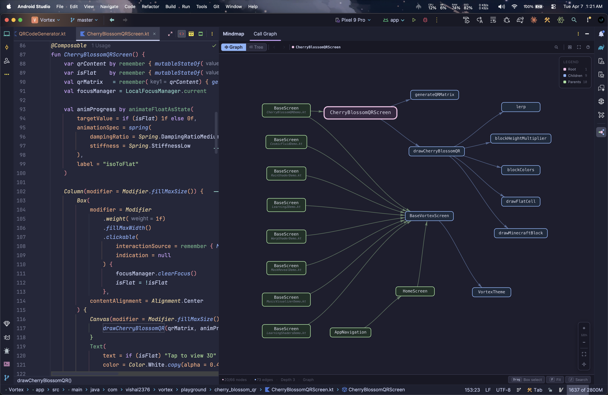

<div align="center">


# **Mindmap**

An IntelliJ IDEA / Android Studio plugin that generates interactive call graph visualizations for **Kotlin** functions. Place your cursor on any function and press **Alt / Option + G** to view the call chain.

<br/>


<br/><br/>

</div>

## Showcase



## Features

- **Bidirectional Call Graph** — Outbound calls + inbound callers with configurable depth (1–5)
- **Hierarchical Layout** — Callers left, root center, callees right with crossing minimization
- **Mini-Map** — VS Code-style overview with colored dots and click/drag navigation
- **Tree View** — Collapsible tree with type-specific icons, section headers, and search
- **Smart Navigation** — Arrow keys, history back/forward, click-to-navigate to source
- **Trace & Expand** — Double-click to merge call graphs, Cmd+Click to re-center
- **Hide/Unhide Nodes** — Hide nodes with cascade logic, floating panel to restore
- **Abstract Tracing** — Traces through abstract/interface functions to concrete implementations
- **Search Filter** — Filter nodes by name across both views
- **Hover Info Cards** — Signature, file location, depth, and LOC count

> For detailed documentation, screenshots, shortcuts, and FAQ visit **[vishal2376.github.io/mindmap](https://vishal2376.github.io/mindmap)**

## Installation

### Requirements

- **IntelliJ IDEA** 2024.3+ or **Android Studio** Ladybug+
- **Kotlin** plugin enabled (bundled by default)

### From JetBrains Marketplace (Recommended)

1. Open **Settings** → **Plugins** → **Marketplace**
2. Search for **"Mindmap"**
3. Click **Install** → Restart IDE

### Build from Source

```bash
git clone https://github.com/vishal2376/mindmap.git
cd mindmap
./gradlew buildPlugin
```

The plugin `.zip` will be at `build/distributions/Mindmap-*.zip`. Install via **Settings → Plugins → ⚙️ → Install Plugin from Disk**.

## License

MIT License — see [LICENSE](LICENSE) for details.
