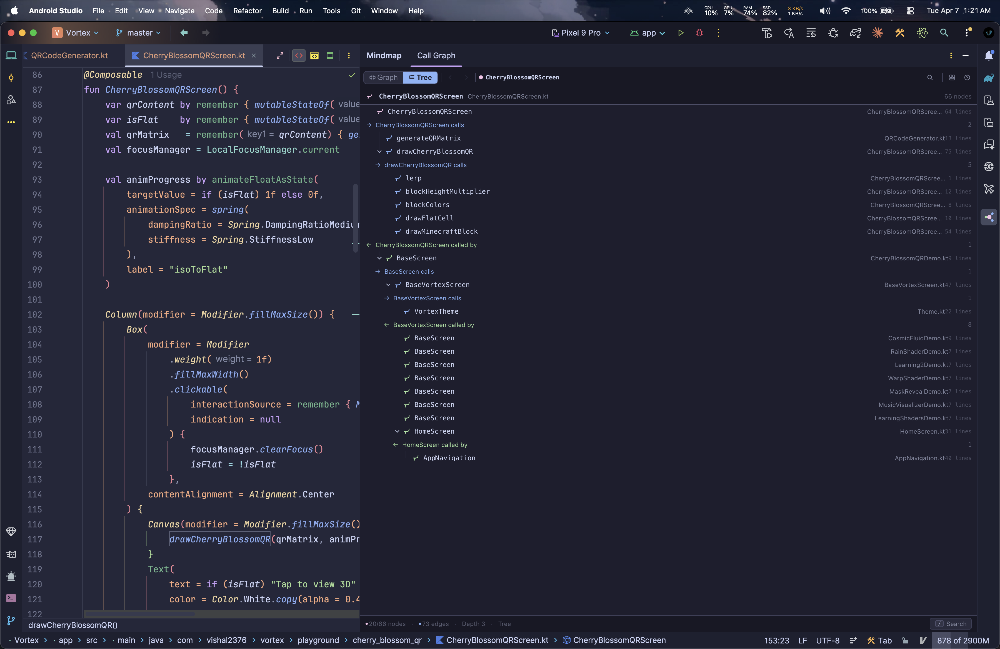
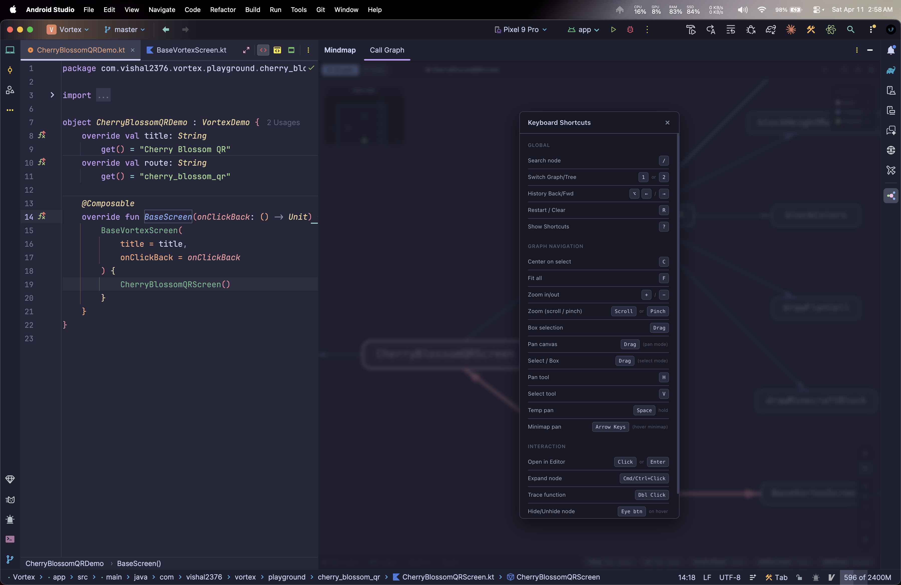
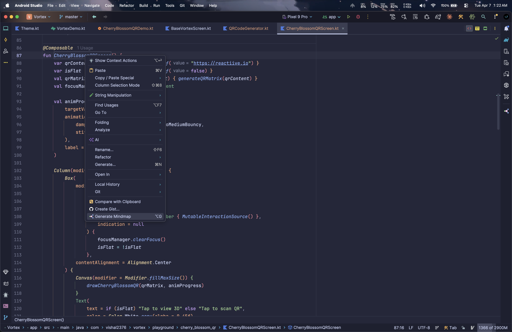

<div align="center">


# **Mindmap**

An IntelliJ IDEA / Android Studio / PyCharm plugin that generates interactive call graph visualizations for **Kotlin**, **Java**, and **Python** functions. Place your cursor on any function and press **Alt+G** to view the call chain - callers, callees, and function depth.

<br/>


<br/><br/>
</div>

## Table of Contents

- [Features](#-features)
- [Controls](#️-mouse-controls)
- [Shortcuts](#️-keyboard-shortcuts)
- [Installation](#-installation)
- [Architecture](#️-architecture)
- [Security & Performance](#-security)
- [Troubleshooting](#-troubleshooting)
- [License](#-license)

---

## Showcase

**Graph View**<br/>


**Tree View**<br/>


**Keyboard Shortcuts**<br/>


**Context Menu**<br/>


---

## Features

### Language Support
- **Kotlin** — Full support (K1 & K2), IntelliJ IDEA & Android Studio
- **Java & Python** — *See [Future Roadmap](#-future-roadmap)*

### Graph View
- **Hierarchical Layout** - Callers on the left, root in the center, callees on the right
- **Crossing Minimization** - Hubsize sorting, edge minimization, block shifting, and shake-towards-leaves for clean layouts
- **Straight-Line Edges** - High-performance straight edges (no bezier curve computation)
- **Box Selection** - Drag on empty canvas (select mode) to select multiple nodes
- **Multi-node Move** - Drag any selected node to move all selected together
- **Free Positioning** - Move nodes freely in both horizontal and vertical axes
- **Smart Labels** - Duplicate function names show their file name as subtitle
- **Pan Mode (H)** - Drag a node to move it; drag empty space to pan the canvas
- **Select Mode (V)** - Drag empty space for box/marquee selection
- **Figma-style Zoom** - Scroll wheel, pinch-to-zoom, `+`/`-` keys with requestAnimationFrame batching for 60fps smoothness

### Mini-Map
- **Live Overview** - VS Code-style minimap in the top-left corner showing the entire graph at a glance
- **Colored Dots** - Nodes colored by type: pink (ROOT), blue (OUTBOUND), green (INBOUND)
- **Viewport Rectangle** - Semi-transparent rectangle showing current view area with dimmed regions outside
- **Click-to-Pan** - Click anywhere on the minimap to jump to that area
- **Drag-to-Pan** - Hold and drag on the minimap to continuously navigate
- **Arrow Key Pan** - Hover over the minimap and use arrow keys to nudge the viewport
- **Auto-visibility** - Only shows in graph view when nodes exist; hidden in tree view and welcome screen

### Hide / Unhide Nodes
- **Eye Button on Hover** - Hover any node to reveal an eye icon; click to hide the node
- **Cascade Hide** - Children only reachable through the hidden node are automatically hidden too
- **Smart Cascade** - Children connected to other visible nodes (parent or sibling) stay visible
- **Layout Preservation** - Hidden nodes keep their position in the hierarchy across retraces
- **Disabled Interaction** - Hidden nodes can't be clicked, expanded, or traced (toast: "Unhide node first")
- **Hidden Nodes Panel** - Bottom-left floating panel auto-appears listing all hidden nodes with one-click unhide
- **Collapsible Panel** - Click the panel header to minimize/expand; count badge shows number of hidden nodes

### Settings
- **Settings Modal** - Gear button in toolbar opens a polished settings panel
- **Outbound Depth (1-5)** - Controls how many levels deep to follow function calls made by the root
- **Inbound Depth (1-5)** - Controls how many levels up to find functions that call the root
- **Visual Depth Track** - 5-segment colored bar showing current depth value at a glance
- **Descriptions** - Each depth setting includes a clear explanation with examples

### Tree View
- **Collapsible Tree** - Expand/collapse with chevron icons
- **Type-specific Icons** - Distinct icons for ROOT, OUTBOUND, INBOUND, and library nodes
- **Section Headers** - `fetchUser calls` / `fetchUser called by` with count badges and directional arrows
- **Filter Support** - Search filter works across tree view with "no matches" empty state
- **Scroll to Selected** - Selected node auto-scrolls into view

### Analysis
- **Bidirectional** - Outbound calls (children) + inbound callers (parents)
- **Abstract Function Tracing** - Traces through abstract/interface functions to up to 3 concrete implementations
- **Trace** - Double-click a node to merge its call graph into the view
- **Expand** - Cmd+Click (Ctrl+Click on Linux/Win) to re-center the graph on a function
- **Configurable Depth** - Adjust outbound (1-5) and inbound (1-5) trace depth from settings

### Navigation
- **History** - Navigate back/forward through explored functions (`Alt+`/`Alt+`)
- **Smart Navigation** - Use `Arrow keys` to move to parents, children, or cycle through siblings
- **Click-to-Navigate** - Single click or `Enter` jumps to source code in the editor
- **Search Filter** - Filter nodes by name across both views (`/`)
- **Hover Info Cards** - Signature, file location, depth, and LOC count
- **Restart / Clear** - `R` key or toolbar button to wipe graph data and free memory


## Mouse Controls

| Action | Effect |
|---|---|
| **Left-click** node / **Enter** | Navigate to source code |
| **Cmd+Click** node (macOS) / **Ctrl+Click** (Linux/Win) | Expand - re-center graph on that function |
| **Double-click** node | Trace - merge its call graph into current view |
| **Left-drag** node *(pan mode)* | Move the node |
| **Left-drag** empty space *(pan mode)* | Pan the canvas |
| **Space + Drag** empty space *(select mode)* | Temporary pan while in select mode |
| **Left-drag** empty space *(select mode)* | Box/marquee selection |
| **Left-drag** selected node *(select mode)* | Move all selected nodes freely |
| **Right-drag** / **Middle-drag** | Pan the viewport (either mode) |
| **Scroll wheel** / **Two-finger scroll** | Zoom in/out (60fps rAF batched) |
| **Pinch** | Zoom in/out (Figma-style, cursor-centered) |
| **Hover node** + **Eye button** | Hide/unhide the node |
| **Click minimap** | Jump to that area of the graph |
| **Drag minimap** | Continuously pan the viewport |


## Keyboard Shortcuts

| Shortcut | Action |
|---|---|
| **`Alt+G`** | Generate call graph for function at cursor |
| **`Alt+`** / **`Alt+`** | Navigate history back / forward |
| **`1`** / **`2`** | Switch to **Graph** / **Tree** view |
| **`H`** / **`V`** | Switch to **Pan tool** / **Select tool** |
| **`Space` (hold)** | Temporary pan while in Select mode |
| **`Arrow keys`** | Navigate parents/children or cycle siblings |
| **`Arrow keys`** *(hover minimap)* | Pan the viewport via minimap |
| **`F`** | Fit all nodes in view |
| **`C`** | Center on selected node |
| **`+`** / **`-`** | Zoom in / out |
| **`/`** | Open search filter |
| **`R`** | Restart / Clear graph data |
| **`Enter`** | Navigate to selected node's source |
| **`Escape`** | Deselect all nodes or close modals |
| **`?`** | Show Keyboard Shortcuts modal |


## Installation

### Requirements
- **IntelliJ IDEA** 2024.3+, **Android Studio** Ladybug+, or **PyCharm** 2024.3+
- **Kotlin** plugin enabled (bundled with IntelliJ/AS)
- **Python** plugin required for Python support (bundled with PyCharm)

### From JetBrains Marketplace
1. Open **Settings** → **Plugins** → **Marketplace**
2. Search for **"Mindmap"**
3. Click **Install** → Restart IDE

### Build from Source
```bash
git clone https://github.com/vishal2376/mindmap.git
cd mindmap
./gradlew buildPlugin
```
The plugin `.zip` will be at `build/distributions/Mindmap-*.zip`.


## Architecture

```
src/main/
├── kotlin/com/mindmap/plugin/
│   ├── actions/
│   │   └── ShowCallGraphAction.kt    # Entry point (Alt+G), language dispatch
│   ├── analysis/
│   │   ├── CallGraphModel.kt         # Data structures (nodes, edges)
│   │   └── GraphAnalyzer.kt          # Kotlin call graph builder (K1 & K2)
│   └── ui/
│       ├── GraphToolWindowFactory.kt  # Tool window + JCEF fallback
│       └── MindMapPanel.kt           # JCEF browser, JS bridge, history
└── resources/
    ├── META-INF/plugin.xml            # Plugin descriptor
    └── webview/graph.html             # UI (vis-network, CSS, event handlers)
```


## Security

- **No external network calls** - CSP blocks all connections except vis-network CDN
- **Base64 encoding** - Graph data is Base64-encoded before JS injection
- **Message size limits** - JS to Kotlin bridge rejects messages >2KB
- **URL validation** - Only `http`/`https` URLs are allowed for external browsing
- **Node ID validation** - Regex pattern rejects malformed/injected node IDs
- **XSS prevention** - All user-facing text is HTML-escaped via `esc()` function

## Performance

- **300 node cap** - Prevents graph explosion on large codebases
- **50 calls/function limit** - Limits outbound analysis per function body
- **30 inbound refs limit** - Caps caller search per function
- **Straight-line edges** - No bezier curve computation overhead
- **Shadows disabled** - GPU-intensive shadow rendering turned off
- **Animations disabled** - All viewport transitions are instant
- **rAF-batched zoom** - Scroll/pinch zoom uses requestAnimationFrame for 60fps
- **Library nodes excluded** - SDK/library calls permanently filtered for clarity and speed
- **Lazy tool window** - Only initializes when triggered
- **Deep clone safety** - Node specs use `JSON.parse(JSON.stringify())` to prevent shared-reference corruption


## Troubleshooting

### "JCEF Not Available" in Android Studio
Android Studio may ship with a JBR that doesn't include JCEF. To fix:
1. Go to **Help → Find Action** (or `Cmd+Shift+A`)
2. Search for **"Choose Boot Java Runtime"**
3. Select a runtime that includes **JCEF** (typically labeled with `JCEF`)
4. Click **OK** and **restart** the IDE

### Alt+G shortcut not working
If another plugin (like IdeaVIM) intercepts the shortcut, go to **Settings → Keymap** and assign a different shortcut to **"Generate Mindmap"**. Or simply use **right-click → Generate Mindmap**.


## Future Roadmap

- [ ] **Java Support** — Full call graph analysis for Java methods
- [ ] **Python Support** — Call graph analysis for Python functions
- [ ] **Export Options** — Save graph as SVG, PNG, or JSON
- [ ] **Custom Themes** — Allow users to define their own color palettes
- [ ] **Advanced Filtering** — Filter by depth, visibility, or specific packages


## Author

**Vishal Singh** - [@vishal2376](https://github.com/vishal2376)


## License

MIT License — see [LICENSE](LICENSE) for details.
